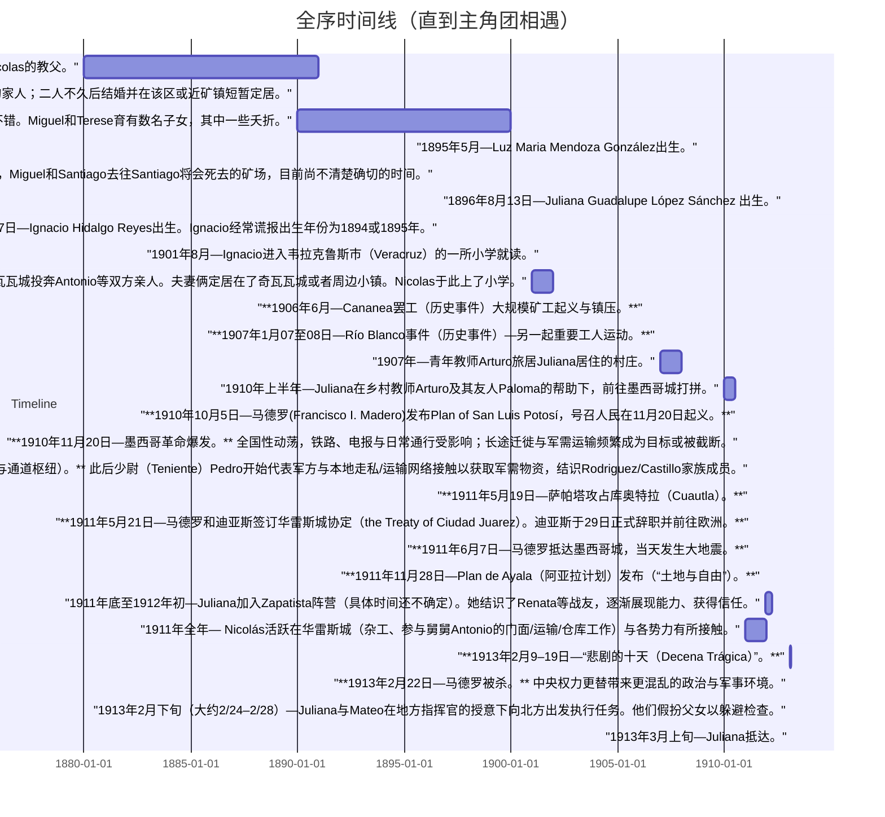

# 大地的回声 时间线

目前截止至1913年，部分角色施工中。

## 主要角色

Juliana Guadalupe Lopez Sanchez⭐️

Nicolas Lorenzo Rodriguez Castillo⭐️

Luz Maria Mendoza Gonzalez⭐️

Ignacio Hidalgo Reyes⭐️

Gustavo Lopez & Aurelia Sanchez de Lopez

Arturo Salinas

Paloma Navarro

Renata Blanco

Mateo Aguirre

Miguel Rodriguez

Teresa Castillo de Rodriguez

Antonio Castillo

Santiago Martinez

Pedro Robles

## 时间线

